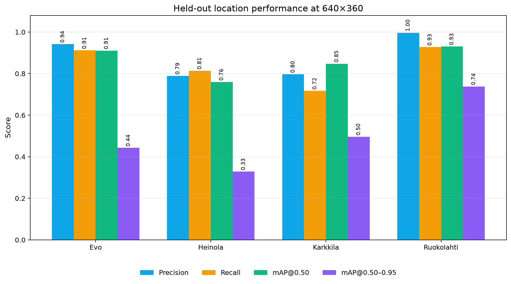
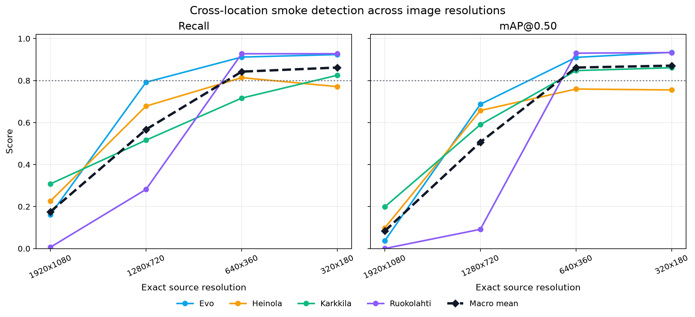

# Wildfire Smoke Detection with Location-Based YOLO Evaluation

This repository contains a reproducible benchmark for UAV smoke detection using the **Boreal Forest Fire Subset A**. A lightweight YOLO11n detector was trained on three Finnish forest locations and evaluated on the fourth, repeating the experiment for Evo, Heinola, Karkkila, and Ruokolahti. The same held-out models were evaluated at four exact image resolutions.

## Main findings

- 4,954 labeled UAV images: 4,693 with smoke and 261 with empty labels.
- 4,862 published smoke bounding boxes in one YOLO class: `0 = smoke`.
- Best practical settings were 640x360 and 320x180 for this model trained at 640-pixel scale.
- At 640x360, macro recall was 84.2% and macro mAP@0.50 was 86.2%.
- At 320x180, macro recall was 86.2% and macro mAP@0.50 was 87.1%.
- Heinola was the hardest held-out location overall.
- A visual audit found six empty-label images that visibly contain smoke and one genuine bright-sky/haze false alarm at confidence 0.25.

### Held-out performance at 640x360

| Test location | Precision | Recall | mAP@0.50 | mAP@0.50-0.95 |
|---|---:|---:|---:|---:|
| Evo | 94.2% | 91.2% | 91.0% | 44.3% |
| Heinola | 78.9% | 81.4% | 76.0% | 32.9% |
| Karkkila | 79.7% | 71.6% | 84.7% | 49.6% |
| Ruokolahti | 99.7% | 92.8% | 93.0% | 73.8% |

### Resolution comparison

| Resolution | Precision | Recall | mAP@0.50 | mAP@0.50-0.95 |
|---|---:|---:|---:|---:|
| 1920x1080 | 17.1% | 17.5% | 8.3% | 1.9% |
| 1280x720 | 55.4% | 56.7% | 50.6% | 17.7% |
| 640x360 | 88.1% | 84.2% | 86.2% | 50.1% |
| 320x180 | 88.3% | 86.2% | 87.1% | 51.5% |

The high-resolution collapse is an inference-scale mismatch, not evidence that higher-resolution cameras are intrinsically worse. Training resized images to a 640-pixel canvas; directly evaluating on a 1920-pixel canvas made the smoke objects much larger than the model's training distribution.

## Repository contents

```text
data/
  labels/                 Complete 4,954 YOLO label files
  manifests/              Portable image index, split membership, and archive hashes
  README.md               Download, layout, license, and known-label notes
docs/
  Wildfire_Smoke_Detection_Report.pdf
models/                    Four best YOLO11n checkpoints
results/
  figures/                 Ground truth, graphs, error examples, and learning curves
  metrics/                 All aggregate and per-image CSV/JSON results
  training/                Sanitized run configurations and training histories
scripts/                   Audit, split, train, resolution-test, and error-analysis code
```

The multi-gigabyte raw and resized image copies are intentionally excluded. GitHub blocks regular Git objects over 100 MiB and recommends keeping repositories small. Download the images from the official dataset and use the included labels and manifests to reproduce the exact experiment.

## Quick start

1. Read [`data/README.md`](data/README.md) and download **Boreal-Forest-Fire-Subset-A**.
2. Create a Python environment and install [`requirements.txt`](requirements.txt).
3. Arrange the images as `images/<Location>/<filename>.jpg` and labels as `labels/<Location>/<filename>.txt`.
4. Use the portable fold lists under `data/manifests/splits/` or regenerate them with the scripts.
5. Follow [`REPRODUCIBILITY.md`](REPRODUCIBILITY.md) for the exact commands and settings.

## Reports and figures

- [`docs/Wildfire_Smoke_Detection_Report.pdf`](docs/Wildfire_Smoke_Detection_Report.pdf)
- [`results/RESULTS.md`](results/RESULTS.md)
- [`results/metrics/resolution_metrics.csv`](results/metrics/resolution_metrics.csv)
- [`results/metrics/errors_320x180.csv`](results/metrics/errors_320x180.csv)





## Dataset source and license

Dataset: [Boreal Forest Fire: UAV-collected Wildfire Detection and Smoke Segmentation Dataset](https://etsin.fairdata.fi/dataset/1dce1023-493a-4d63-a906-f2a44f831898), DOI [`10.23729/fd-72c6cf74-b8eb-3687-860d-bf93a1ab94c9`](https://doi.org/10.23729/fd-72c6cf74-b8eb-3687-860d-bf93a1ab94c9).

The source dataset is licensed under **CC BY 4.0**. See [`CITATION.md`](CITATION.md) and [`NOTICE.md`](NOTICE.md). No separate license has been selected for the repository's newly written scripts; the repository owner should choose one before public release.

